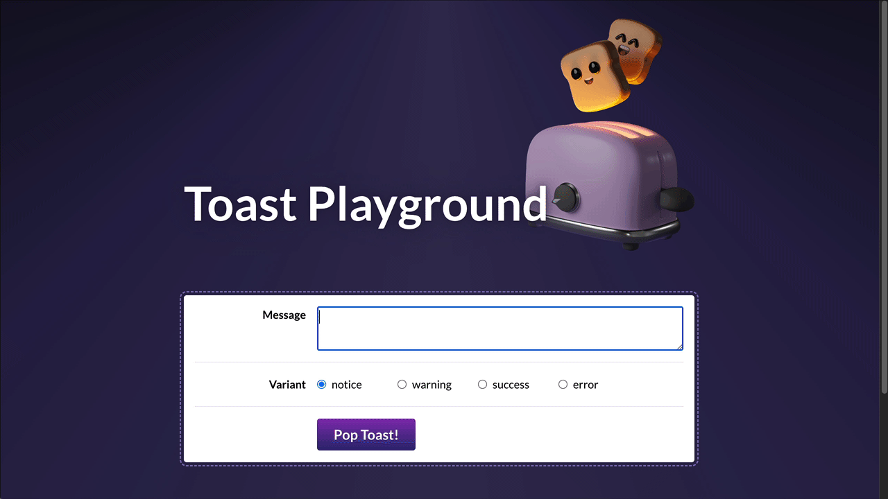

# Toast Component Project

## Joy of React, Project II

In this project, we'll dive deep into the implementation of a single common UI component: A `<Toast>` message component.



## Getting Started

This project is created with [Parcel](https://parceljs.org/). It's intended to be run locally, on your computer, using Node.js and NPM.

During the first project, Wordle, we saw how to run a local development server. If you're not quite sure how to get started, I recommend reviewing the [“Local Development” instructions](https://courses.joshwcomeau.com/joy-of-react/project-wordle/03-dev-server) lesson.

To jog your memory, here are the terminal commands you'll need to run:

```bash
# Install dependencies:
npm install

# Run a development server:
npm run dev
```
[Hosted Link](https://toast-component-by-kiren.vercel.app/)
